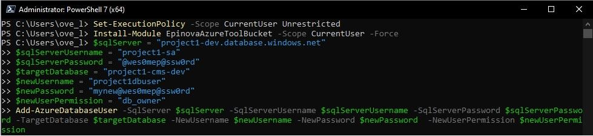

# Add-AzureDatabaseUser
Create a database user for a specific database on a Azure SQL Server instance.

## Prerequisite
### PowerShellGet
Since PowerShell Gallery is involved, you need to have PowerShellGet installed. Instructions how to install PowerShellGet (https://docs.microsoft.com/en-us/powershell/scripting/gallery/installing-psget?view=powershell-7.1).
## Create Azure database user login
1.	First open up PowerShell prompt as an administrator.
2.	Start type 
```powershell
Set-ExecutionPolicy -Scope CurrentUser Unrestricted
```
This is to remove warnings if your environment does not trust these scripts.  
3.	Then install the EpinovaAzureToolBucket. 
```powershell
Install-Module EpinovaAzureToolBucket -Scope CurrentUser -Force
```  
4.	Add the code below and make the changes needed to fit your context.
```powershell
$sqlServer = "project1-dev.database.windows.net"
$sqlServerUsername = "project1-sa"
$sqlServerPassword = "@wes0mep@ssw0rd"
$targetDatabase = "project1-cms-dev"
$newUsername = "project1dbuser"
$newPassword = "mynew@wes0mep@ssw0rd"
$newUserPermission = "db_owner"
Add-AzureDatabaseUser -SqlServer $sqlServer -SqlServerUsername $sqlServerUsername -SqlServerPassword $sqlServerPassword -TargetDatabase $targetDatabase -NewUsername $newUsername -NewPassword $newPassword  -NewUserPermission $newUserPermission
```
  
5.	After pushing the enter button the script will start to create the database user/login. And if everything is ok it can look like the following result.
  
You can also see that you will be able to copy the new connection string into your Episerver project and start using it.


[<< Back](..\..\README.md)