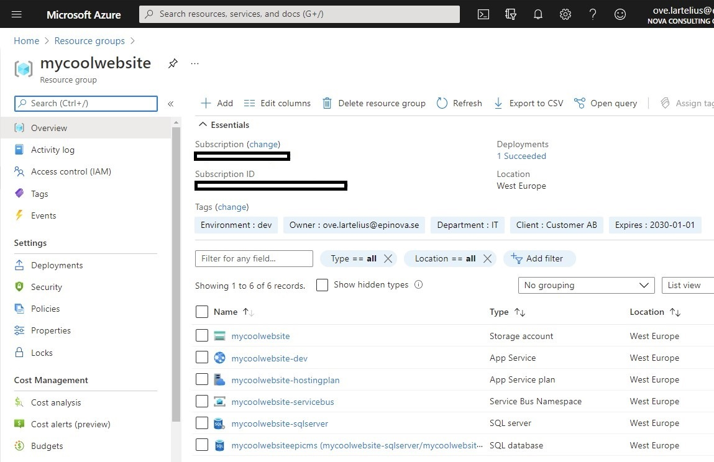
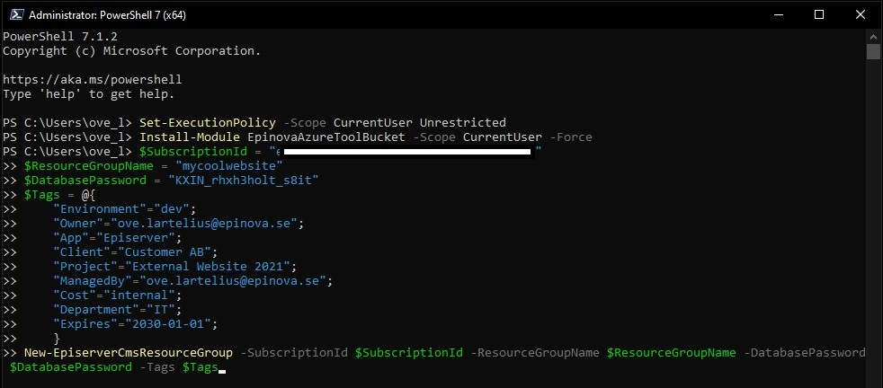
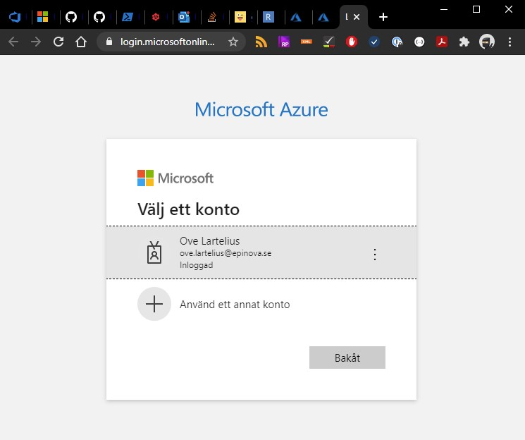
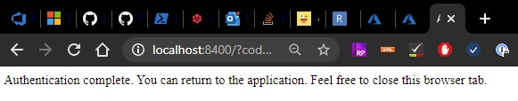
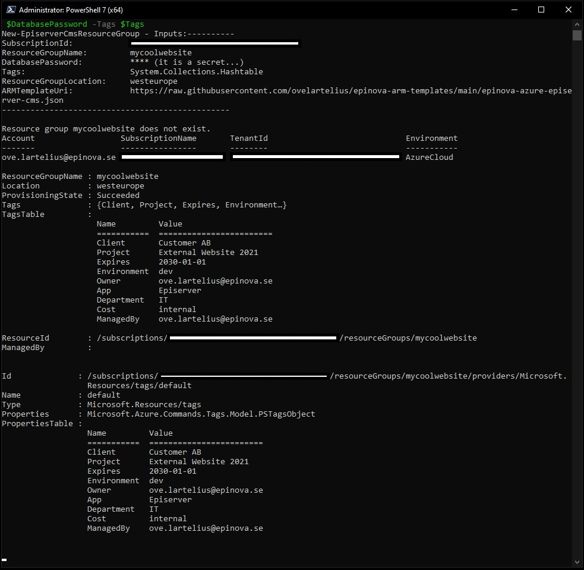
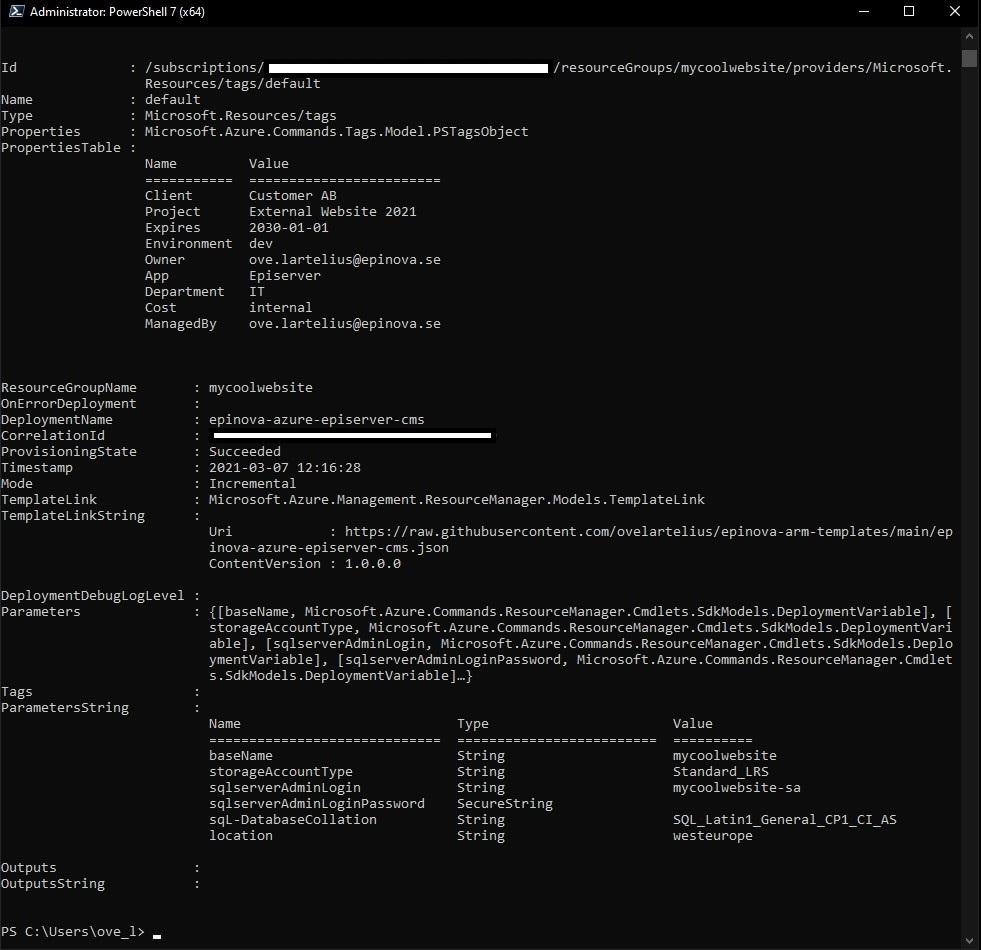
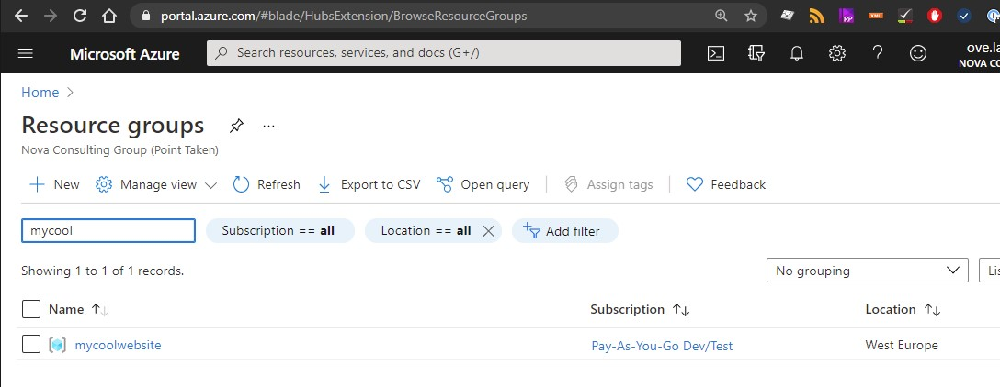
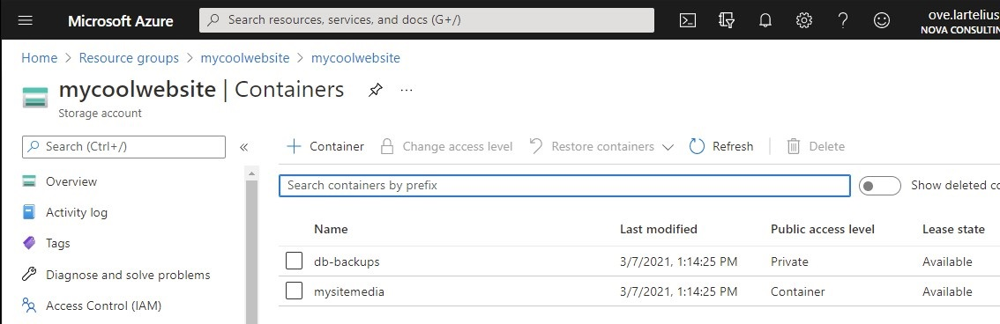
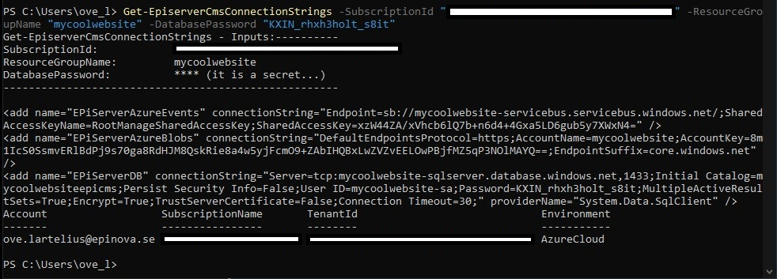

# Create a Episerver/Optimizely CMS setup in Azure portal



## Prerequisite
### PowerShellGet
Since PowerShell Gallery is involved, you need to have PowerShellGet installed. [Instructions how to install PowerShellGet](https://docs.microsoft.com/en-us/powershell/scripting/gallery/installing-psget?view=powershell-7.1).  
### Azure PowerShell
You need to have Azure PowerShell installed. [How to install Azure PowerShell](https://docs.microsoft.com/en-us/powershell/azure/install-az-ps?view=azps-5.6.0).   
### SubscriptionId
You need to have the SubscriptionId from Azure Portal so the script knows where you want to create your resource group. Note that you may have more then one Subscription in Azure Portal so you need to know which one you want to use. I will describe 2 ways to retrieve this information.  
#### Using PowerShell
You can use the PowerShell prompt and write “Get-AzSubscription”. A list of your subscriptions till be presented for you. Select the one where you want the new resource group to be created in.
[More information about the Get-AzSubscription function](https://docs.microsoft.com/en-us/powershell/module/az.accounts/get-azsubscription?view=azps-5.6.0).  
#### Manually
[Microsoft description how to get your Azure subscription id](https://docs.microsoft.com/en-us/azure/media-services/latest/how-to-set-azure-subscription?tabs=portal).  
### Database password
Generate a new password that you will use for this new SqlServer/Database. Make sure that you also store this password in a good place so you and your colleagues can get this later if needed. [Also make sure that you follow Microsoft Password Policy in AzureAD](https://docs.microsoft.com/en-us/previous-versions/azure/jj943764(v=azure.100)?redirectedfrom=MSDN).  

## Create resource group.
1.	First open up PowerShell prompt as administrator.
2.	Start type “Set-ExecutionPlicy -Scope CurrentUser Unrestricted”. You do that to remove warnings if your environment does not trust these scripts.
3.	Then install the EpinovaAzureToolBucket. “Install-Module EpinovaAzureToolBucket -Scope CurrentUser -Force” 
4.	Now it is time the create the actual resource group. I will copy the example from our GitHub repository, add your SubscriprionId and the new nice password for the SqlServer:
```powershell
   $SubscriptionId = "95a9fd36-7851-4918-b8c9-f146a219982c"
    $ResourceGroupName = "mycoolwebsite"
    $DatabasePassword = "KXIN_rhxh3holt_s8it"
    $Tags = @{
        "Environment"="dev";
        "Owner"="ove.lartelius@epinova.se";
        "App"="Episerver";
        "Client"="Customer AB";
        "Project"="External Website 2021";
        "ManagedBy"="ove.lartelius@epinova.se";
        "Cost"="internal";
        "Department"="IT";
        "Expires"="2030-01-01";
        }
    New-EpiserverCmsResourceGroup -SubscriptionId $SubscriptionId -ResourceGroupName $ResourceGroupName -DatabasePassword $DatabasePassword -Tags $Tags
```
My prompt look like this now:  

 
5.	After pushing the enter button the script will start to create the resource group. The first thing that will happened is that your browser will popup so that you can identify yourself against Azure Portal.  
   
When done you can close the tab in your browser:  

 
6.	The script is now executing, and it may take a couple of minutes to setup all the resources. If you would get any errors. Please read the messages and make sure that you have not used a week password etc. There are most often the input parameters that are wrong that stops Azure to create the resources. If you get a error and want to run again. My tips are to go to Azure Portal and delete the resource group and start the script again with updated params.  

7.	When the script is done you have successfully created the resource group.  

And in Azure portal you can see that all the resources have been created. You can start search for the new resource group.  
  
  
  

8.	And now we can do that last step. Retrieve the connection strings for the database, service bus and storage account. I do that by writing:
``` powershell 
Get-EpiserverCmsConnectionStrings -SubscriptionId '95a9fd36-7851-4918-b8c9-f146a219982c' -ResourceGroupName 'mycoolwebsite' -DatabasePassword 'KXIN_rhxh3holt_s8it'
```  
  
You can now copy and paste this information to your web.config.

## More advance stuff
### Use your own ARM template!
If you don´t want to use the Epinova ARM template that is used by default, you can always take a copy of the https://raw.githubusercontent.com/Epinova/EpinovaAzureToolBucket-psmodule/main/ArmTemplates/epinova-azure-basic-episerver-cms.json and make your own ARM template. You can now specify your own ARM template when execute New-EpiserverCmsResourceGroup with the parameter: “-ArmTemplateUri = ‘https://raw.githubusercontent.com/yourrepository/arm-templates/main/azure-episerver-cms.json’”

### ResourceGroupLocation
The default setting for this is westeurope. Im sorry for all the developers that want their location to be somewhere else. But you can specify this yourself. Just use the parameter “-ResourceGroupLocation” and you can override that default setting.
You can use “Get-AzLocation | Format-Table” to get a list of all available locations that you can specify as location.

[<< Back](/Readme.md)