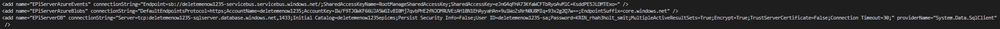
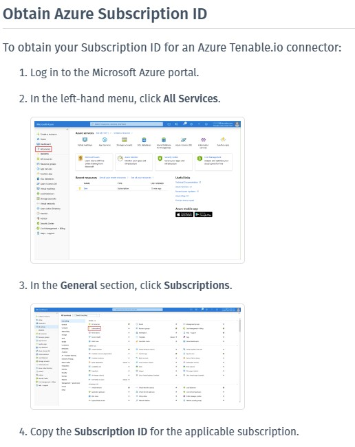

# Get-EpiserverCmsConnectionStrings
Get and print the connection strings for specified resource group.  
  
## Parameters
### SubscriptionId
Your Azure SubscriptionId that holds the resource group.

### ResourceGroupName
The name of the resource group.

### DatabasePassword
The password to your database. The password that you specified when you created the database.

### DatabaseName
If you have used your own ARM template. You may have used another database name then Epinovas example template. Then specify the name of the database.

### Examples
#### Example 1
```powershell
$SubscriptionId = "95a9fd36-7851-4918-b8c9-f146a219982c"
$ResourceGroupName = "mycoolwebsite"
$DatabasePassword = "KXIN_rhxh3holt_s8it"
Get-EpiserverCmsConnectionStrings -SubscriptionId $SubscriptionId -ResourceGroupName $ResourceGroupName -DatabasePassword $DatabasePassword
```

#### Example 2
```powershell
Get-EpiserverCmsConnectionStrings -SubscriptionId "95a9fd36-7851-4918-b8c9-f146a219982c" -ResourceGroupName "mycoolwebsite" -DatabasePassword "KXIN_rhxh3holt_s8it"
```

# How to get Subscription ID
## Powershell
You can use powershell to get the subscription you are connected to.  
```powershell
Get-AzSubscription
```
[Read more about Get-AzSubscription @ doc.microsoft](https://docs.microsoft.com/en-us/powershell/module/az.accounts/get-azsubscription?view=azps-5.6.0)
## Manually
  

[<< Back](..\..\README.md)