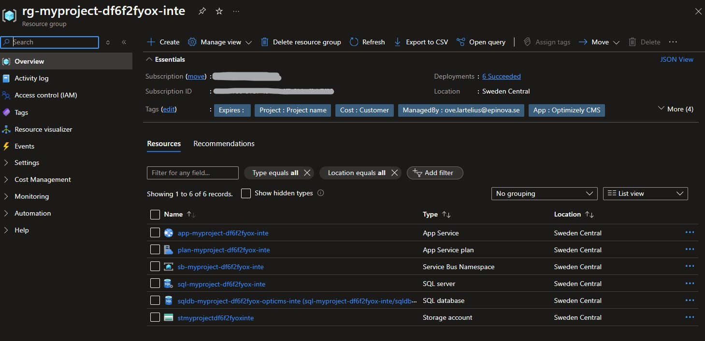

# New-OptimizelyCmsResourceGroupBicep
Create or update a resource group in Azure subscription following Epinova template for Optimizely CMS project.  
The following resources will be created:  
* App service plan
* AppService
* Application Insight
* Service bus
* Storage account
* SQL Server
* SQL Database
  
If the *.bicep file does not exist the function will try to download the bicep file from GitHub repo and place it in the same folder as the PowerSHell module script.

## Prerequisite
### PowerShellGet
Since PowerShell Gallery is involved, you need to have PowerShellGet installed. Instructions how to install PowerShellGet (https://docs.microsoft.com/en-us/powershell/scripting/gallery/installing-psget?view=powershell-7.1).
### Access rights in Azure
Account/Service Prinicipal under which script will work should have proper permission (Contributor) assigned to storage account.

## Create Azure database user login
1.	First open up PowerShell prompt as an administrator.
2.	Start type 
```powershell
Set-ExecutionPolicy -Scope CurrentUser Unrestricted
```
This is to remove warnings if your environment does not trust these scripts.  
3. Install or update Az PowerShell
```powershell
# If you need to install AzRm  
Install-Module -Name Az -Repository PSGallery -Force  
# If you need to update AzRm  
Update-Module -Name Az -Force  
```  
4.	Then install the EpinovaAzureToolBucket. 
```powershell
Install-Module EpinovaAzureToolBucket -Scope CurrentUser -Force
```  
5.	Add the code below and make the changes needed to fit your context.
```powershell
#Install-Module -Name Az -Repository PSGallery -Force
#Update-Module -Name Az -Force
Install-Module EpinovaAzureToolBucket -Scope CurrentUser -Force

$Tags = @{
    "Environment"="inte";
    "Owner"="some.dude@epinova.se";
    "App"="Optimizely CMS";
    "Client"="Client name";
    "Project"="Project name";
    "ManagedBy"="ove.lartelius@epinova.se";
    "Cost"="Customer";
    "Department"="IT";
    "Expires"=""; # Or set a date yyyy-MM-dd
}

$SubscriptionId = "95a9fd36-7851-4918-b8c9-f146a219982c"
$ResourceGroupName = "myproject"
$Environment = "inte" # inte|prep|prod
$DatabaseLogin = "myproject-sa"
$DatabasePassword = "Aqtfwcix6ys3iQ8Z"
$CmsVersion = "12" # 11|12
$Location = "swedencentral"
$SqlSku = "Basic"
$AppPlanSku = "B1"
$UseApplicationInsight = $True
$UseAuthentication = $True

New-OptimizelyCmsResourceGroupBicep -SubscriptionId $SubscriptionId -ResourceGroupName $ResourceGroupName -Environment $Environment -DatabaseLogin $DatabaseLogin -DatabasePassword $DatabasePassword -Tags $Tags -CmsVersion $CmsVersion -Location $Location -UseApplicationInsight $UseApplicationInsight -SqlSku $SqlSku -AppPlanSku $AppPlanSku -UseAuthentication $UseAuthentication
```

```powershell
New-OptimizelyCmsResourceGroupBicep -SubscriptionId '95a9fd36-7851-4918-b8c9-f146a219982c' -ResourceGroupName 'mycoolwebsite' -Environment "inte" -DatabaseLogin "databasedbuser" -DatabasePassword 'KXIN_rhxh3holt_s8it' -CmsVersion "12" -Tags @{ "Environment"="dev";"Owner"="ove.lartelius@epinova.se";"App"="Optimizely";"Client"="Client name";"Project"="Project name";"ManagedBy"="Ove Lartelius";"Cost"="Internal";"Department"="IT";"Expires"="";  } -Location = "westeurope" -UseApplicationInsight $True -UseAuthentication $True
```


[<< Back](/README.md)