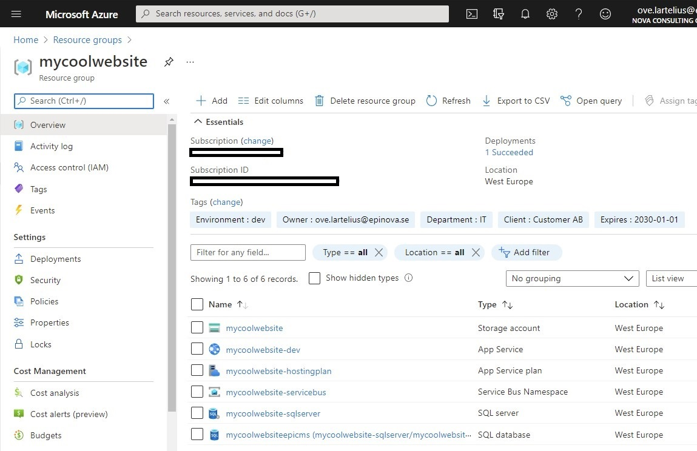

# New-OptimizelyCmsResourceGroupBicep
Create a Optimizely CMS resource group in Azure using a bicep file.  
  

## PARAMETERS 
### SubscriptionId
Your Azure SubscriptionId that you want to create the new resource group in.

### ResourceGroupName
The client secret used to access the project.  
Don´t put in any special characters and stuff. It could end up with errors because of the Azure portal naming convention.  
_**Note: Storage account name must be between 3 and 24 characters in length and use numbers and lower-case letters only.**_

### Environment
The type of environment that you want to create. Please select one of the following: inte|prep|prod

### DatabaseLogin
The username of database login object.

### DatabasePassword
The password to your database that will be generated. You need to follow the password policy. More information about [Password policy in Azure AD](https://docs.microsoft.com/en-us/previous-versions/azure/jj943764(v=azure.100)?redirectedfrom=MSDN)  
The password will be transformed to a SecureString in the function.

### CmsVersion
The CMS version that you want to run on the resource group. Please select one of the following: 11|12  
If 11 is selected a "windows" like webapp is created. If 12 it will be a Linux.  

### Tags
The tags that will be set on the resource group when it is created. We are using the following tags for our projects. These are recommended by Microsoft. You can read more in the [Resource naming and tagging decision guide](https://docs.microsoft.com/en-us/azure/cloud-adoption-framework/ready/azure-best-practices/naming-and-tagging)  
Ex: 
```powershell
$Tags = @{
    "Environment"="dev";
    "Owner"="ove.lartelius@epinova.se";
    "App"="Optimizely";
    "Client"="Customer AB";
    "Project"="External Website 2021";
    "ManagedBy"="ove.lartelius@epinova.se";
    "Cost"="internal";
    "Department"="IT";
    "Expires"="2030-01-01";
    }
```

### Location
The location where the resource group should be hosted. Default = "westeurope". You can get a complete list of location by using ```Get-AzureRmLocation |Format-Table```.

### UseApplicationInsight
If ApplicationInsight should be setup in the resource group or not.

### UseDeviceAuthentication
If the Azure connection should be made with device authentication. Used when execute from ex Azure DevOps.

## Examples
### Example 1
```powershell
$SubscriptionId = "95a9fd36-7851-4918-b8c9-f146a219982c"
$ResourceGroupName = "mycoolwebsite"
$Environment = "inte"
$DatabaseLogin = "someLogin"
$DatabasePassword = "KXIN_rhxh3holt_s8it"
$CmsVersion = "11"
$Tags = @{
    "Environment"="dev";
    "Owner"="ove.lartelius@epinova.se";
    "App"="Optimizely";
    "Client"="Customer AB";
    "Project"="External Website 2021";
    "ManagedBy"="ove.lartelius@epinova.se";
    "Cost"="internal";
    "Department"="IT";
    "Expires"="2030-01-01";
    }
$Location = "westeurope"
$UseApplicationInsight = $true
New-OptimizelyCmsResourceGroupBicep -SubscriptionId $SubscriptionId -ResourceGroupName $ResourceGroupName -Environment $Environment -DatabaseLogin $DatabaseLogin -DatabasePassword $DatabasePassword -Tags $Tags -CmsVersion $CmsVersion -Location $Location -UseApplicationInsight $UseApplicationInsight
```

### Example 2
```powershell
$Tags = @{
    "Environment"="dev";
    "Owner"="ove.lartelius@epinova.se";
    "App"="Optimizely";
    "Client"="Customer AB";
    "Project"="External Website 2021";
    "ManagedBy"="ove.lartelius@epinova.se";
    "Cost"="internal";
    "Department"="IT";
    "Expires"="2030-01-01";
    }
New-OptimizelyCmsResourceGroupBicep -SubscriptionId '95a9fd36-7851-4918-b8c9-f146a219982c' -ResourceGroupName 'mycoolwebsite' -Environment 'inte' -DatabaseLogin 'somelogin' -DatabasePassword 'KXIN_rhxh3holt_s8it' -Tags $Tags -CmsVersion '11' -Location 'westeurope' -UseApplicationInsight $true -UseDeviceAuthentication $true 
```

[<< Back](/README.md)